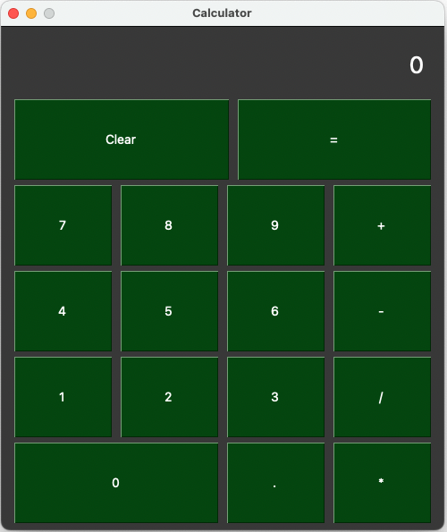
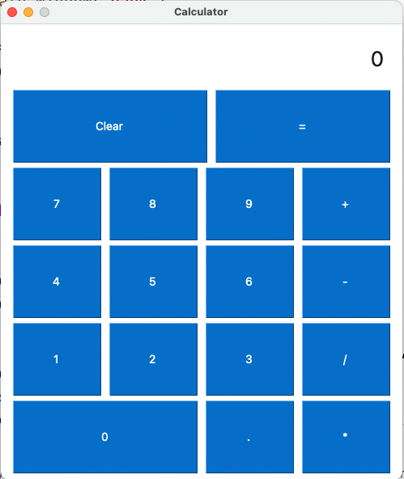
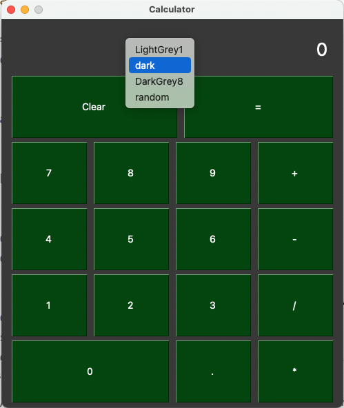

# CALCULATOR
This project develops a calculator as showcase for introducing theming support, contextual menu and styling. 

## Project Overview
This app is a basic UI calculator. One can easily do the four basic operations, as the figure below shows. 



## Basic Operations
Sum, subtraction, division and multiplication are the basic operations considered in this app. Numbers and operations are implemented as buttons, with a label. They are groupped in a layout, as the snippet below shows.

```python
# ...
layout = [
        [sg.Text('0', key = '-TEXT-', font='Franklin 26', justification='right', expand_x=True, pad=(10,20), right_click_menu=theme_menu)],
        [sg.Button('Clear', expand_x=True), sg.Button('=', expand_x=True)],
        [sg.Button(7, size=button_size), sg.Button(8, size=button_size), sg.Button(9, size=button_size), sg.Button('+', size=button_size)],
        #... 
]
# ...
```
Note that each list in a `layout` corresponds to a row in the calculator. Please ignore the additional parameters for now. We going to present them when addressing styling.

When one click on a button, an event is triggered. This is analysed in a conditional that decides what to do. The code below illustrate this decision process.

```python
# ...

    if event in ['0', '1', '2', '3', '4', '5', '6', '7', '8', '9', '.']: # (1)
        current_num.append(event)
        num_string = ''.join(current_num) 
        window['-TEXT-'].update(num_string) # (2)
        
    if event in ['+', '-', '*', '/']: # (1)
        full_operation.append(''.join(current_num))
        current_num = []
        full_operation.append(event)
        window['-TEXT-'].update('') # (2)
        
    if event == '=': # (1)
        full_operation.append(''.join(current_num))
        result = eval(''.join(full_operation)) #(3)
        window['-TEXT-'].update(result) # (2)
        full_operation = []
        current_num = []

# ...
```
1. Checks which button triggered the event.
2. Updates the calculator display.
3. Evaluates the full operation.

## Theme Support and Styling
One can easily add [theme support](https://pysimplegui.readthedocs.io/en/latest/#themes-automatic-coloring-of-your-windows) by using the function `theme()`, from the `PySimpleGUI` library. There is [an official list](https://pysimplegui.readthedocs.io/en/latest/#look-and-feel) of available themes.


<figure>
  
  <figcaption>LightGrey1 theme.</figcaption>
</figure>


This project enables changing the theme while the app is running. To do so, first, we close the window. Then, the window is re-created with the new theme. The code snippet below shows this process. 

```python
# ...
    if event in theme_menu[1]: # (1)
        window.close() # (2)
        window = create_window(event) # (3)
# ...
```

1. Checks if the event is a theme changing request.
2. Closes the window.
3. Creates a new window with the chosen theme.

The `create_window()` function groups the creation window code, including theme setting.

```python
# ...

def create_window(theme):
    sg.theme(theme)
    sg.set_options(font = 'Franklin 14', button_element_size=(4,2))
    button_size = (4,2)
    layout = [
        [sg.Text('0', key = '-TEXT-', font='Franklin 26', justification='right', expand_x=True, pad=(10,20), right_click_menu=theme_menu)],
        [sg.Button('Clear', expand_x=True), sg.Button('=', expand_x=True)],
        [sg.Button(7, size=button_size), sg.Button(8, size=button_size), sg.Button(9, size=button_size), sg.Button('+', size=button_size)],
        [sg.Button(4, size=button_size), sg.Button(5, size=button_size), sg.Button(6, size=button_size), sg.Button('-', size=button_size)],
        [sg.Button(1, size=button_size), sg.Button(2, size=button_size), sg.Button(3, size=button_size), sg.Button('/', size=button_size)],
        [sg.Button(0, expand_x=True), sg.Button('.', size=button_size), sg.Button('*', size=button_size)]
    ]
    
    return sg.Window('Calculator', layout)

# ...
```

The code snippet above shows few styling parameters, as:
- `font` that sets the font type and size.
- `button_element_size` that sets the button size using a measure I don't understand (sorry ...).
- `justification` that sets the text alignment in the UI component.
- `expand_x` that extends the UI component to take the space available.


## Context Menu
The context menu enables changing the theme.



As for creating a `layout`, a context menu is set as list. The first element is a label, and the second element is a list of options, representing available themes. The code below shows the context menu implementation in this project.

```python
# ...
theme_menu = ['menu', ['LightGrey1', 'dark', 'DarkGrey8', 'random']]
# ...
```

The context menu is attached to a UI component. In this project, it is attached to the calculator display, as the code below shows (1).

```python

# ...
[
    sg.Text(
        '0', 
        key = '-TEXT-', 
        font='Franklin 26', 
        justification='right', 
        expand_x=True, 
        pad=(10,20), 
        right_click_menu=theme_menu # (1)
    )
],
# ...
```