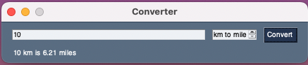

# MEASURE CONVERTER
This is the very first project in this series. Therefore, this also requires the simplest implementation. This project introduces basic components, such as Window, Text and Button. In addition, it shows how to put all these together to make a simple desktop app.

## Project Overview
This app is a very simple measure converter. It converts (i) km to mile, (ii) kg to pound and (iii) sec to min. The app window consists of a text input for the value to be converted, a spinner to select the conversion, a button to dispatch the event, and a label that shows the conversion result.



## PySimpleGUI Basic Structure
The code snippet below shows the most basic structure for any PySimpleGUI app. 


```python
import PySimpleGUI as sg # (1)

layout = [] # (2)

window = sg.Window('Converter', layout) (3)

while True: # (4)
    event, values = window.read() # (5)
    
    if event == sg.WIN_CLOSED: # (6)
        break

window.close() # (7)
```

1. Imports the library into the current code. The library gives access to several UI components. Therefore, it is easier if one sets an alias, as we did.
2. Adds components into the window layout. We discuss layout in more detail ahead.
3. Creates a UI window with _'Converter'_ as title, and `layout` as the container of components.
4. Keeps the window open till the `WIN_CLOSED` event is triggered.
5. Retrieves any triggered event as a `str`, and component values as `dictionaries`.
6. Checks whether a `WIN_CLOSED` event is triggered.
7. Closes the main window.

## Layouts
In PySimpleGUI may be as simple as a list of rows with UI components, as the snippet below shows.

```python
layout = [
    [
        sg.Input(key='-INPUT-'), 
        sg.Spin(['km to mile', 'kg to pound', 'sec to min'], key='-UNITS-'),
        sg.Button('Convert', key='-CONVERT-')
    ], # (1)
    [sg.Text('Output', key='-OUTPUT-')] # (2)
]
```

Each list in `layout` represents a row in the main window UI. In this example, there are two rows (1 and 2). Each row groups a set of UI components. 

## UI Components
UI components are created from the PySimpleGUI component by using its alias (`sg`). The component list [is not exaustive](https://pysimplegui.readthedocs.io/en/latest/call%20reference/#element-and-function-call-reference).

This project uses five UI components: `Window`, `Input`, `Spin`, `Button` and `Text`. Their purpose may be obvious at this point. But the `key` parameter deserves attention.

The `key` parameter sets the name to be used when checking for an event (1), or retrieving a value (2). Note that the names follow a convention starting and ending with dash (`-`).

```python
# ...
if event == '-CONVERT-': # (1)
    
    input_value = values['-INPUT-'] # (2)

# ...
```

Components in the window UI can be accessed as dictionaries by using their `key`: 

```python
# ...
window['-OUTPUT-'].update(output_msg)
# ... 
```
